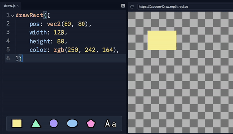
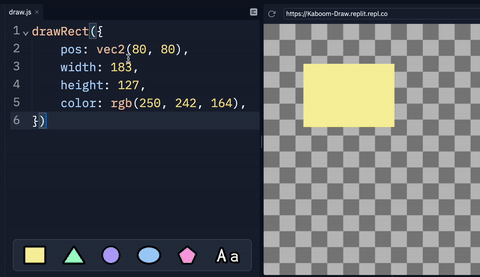
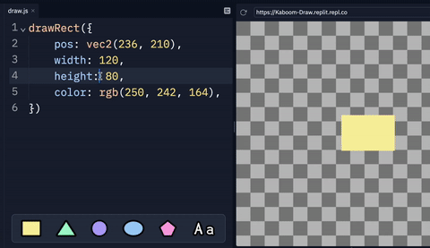
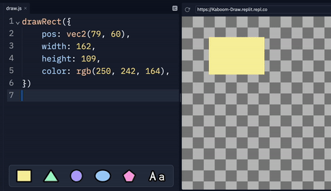
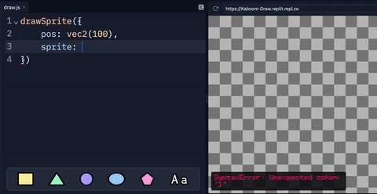

# Kaboom Draw

Create images and animations with code! Powered by kaboom.js

## Examples

There are a few well documented examples under `examples/` that should cover all basic concepts. To use an example simply copy the code to `draw.js` and you should see the results immediately

## Live update

Everything change in `draw.js` is immediately reflected on the canvas, no refresh or recompilation needed.

## Editor interactions

Hold down `alt` key to interact with different values with mouse:

- drag **numbers** horizontally to change their values



- drag **vec2(x, y)** in both direction, the mouse movement is directly mapped to change in the vec2 value



- click on a **rgb(r, g, b)** to open a color selector, enter to confirm, esc to close



- click on a **boolean** to toggle its value

## Shapes backpack

You can probably see there's a strip of shapes on the bottom of the editor when you're on `draw.js`. Drag each of the shape into the editor to insert the code for drawing that specific shape!



## How?

This template uses [Kaboom](https://kaboomjs.com) and exposes a subset of drawing functions, which are similar to other common drawing libraries like p5.js.

Check out the [official documentations](https://kaboomjs.com/#drawSprite) on all the functions. (note: this template actually uses `kaboom@next` which might be slightly different from the current latest stable version)

## Saving the work

- Click the camera icon on the webview url bar to save the current image
- Click the record icon next to the camera icon to toggle recording. It'll be save as an mp4 file.

## Images

Yes of course you can use images here. Simply add a

```js
drawSprite({
	sprite: /* drop or paste your image here */,
	pos: vec2(100, 100),
})
```

and drop / paste your image from you system's file explorer. The image is also rendered inline in the editor (they are base64 dataurl strings under the hood)



## How does this work?

Basically

```js
import kaboom from "kaboom"

kaboom()

onDraw(() => {
	eval(drawJSContent)
})
```

we're evaluating the code in `draw.js` in kaboom's `onDraw()` event, which runs ~60 times per second.

Click "Show hidden files" in the filetree menu and check out / edit `main.ts` which contains the live update mechanism.

## State

Since the code in `draw.js` is evaluated every frame, there's no inherent way to have persistent state. Kaboom Draw provides an exclusive function `init()` that allows you to have persistent state (see `examples/10_state.js`)

```js
// pass the initial state to the function
// any update to this state requires reload
const state = init({
	trail: [],
})

if (isMouseMoved()) {
	state.trail.push(mousePos())
}

drawLines({
	pts: state.trail,
	width: 2.
})
```

## Customizing

Click "Show hidden files" in the filetree menu and check out `index.html` and `main.ts`. Feel free to change the canvas size, make it full screen, or completely change the mechanics.